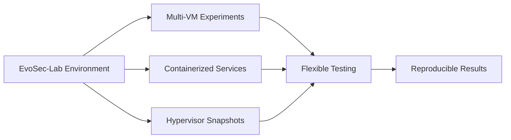
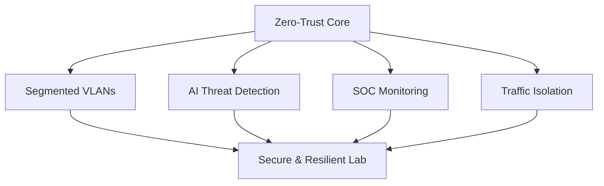

 

---

##  Welcome to EvoSec

EvoSec is a cybersecurity research lab designed for experimentation and operational analysis. The platform brings together honeypots, intrusion detection, automation, and monitoring into a unified environment, enabling practical testing and innovation. 

This wiki provides an overview of EvoSec’s architecture, components, and applications.

---

##  Key Features 

| Feature | Description |
|:------:|:-----------|
| **Enterprise-Grade Infrastructure** | High-performance servers, storage, and networking provide a professional-grade lab for advanced research and experimentation. |
| **Segregated Lab Zones** | VLANs create isolated spaces for honeypots, tar pits, DMZs, and management networks, enabling safe and flexible testing. |
| **AI-Driven Automation** | Large language models orchestrate network, security, and lab operations in real time for rapid, intelligent responses. |
| **Automated Workflows** | Pipelines streamline VM provisioning, software deployment, and configuration management at scale. |
| **Full Observability** | Monitoring and dashboards for intrusion detection and log aggregation provide actionable insights across the environment. |
| **Zero-Trust Security** | Compartmentalized VMs, automated threat response, and SOC integration enforce strict operational security. |

---

## Quick Navigation

  
<strong>Jump to:</strong>

   [Architecture](Architecture) – Network design, trust zones, and top-level infrastructure  
   [Hardware](Hardware) – Servers, storage, networking, and SOC devices  
   [Software Stack](Software%20Stack) – Hypervisors, OS templates, orchestration, and monitoring tools  
   [Network Topology](Network%20Topology) – VLANs, traffic flows, and dynamic orchestration  
   [CI/CD & Automation](CI%2FCD%20%26%20Automation) – Pipelines, IaC, and LLM integration  
   [Monitoring & Telemetry](Monitoring%20%26%20Telemetry) – Metrics, dashboards, and SOC workflow  
   [Security Model](Security%20Model) – Zero-trust zones, isolation, and automated security policies  
   [Use Cases](Use%20Cases) – Real-world applications and demonstrations  
   [Roadmap](Roadmap) – Planned enhancements, expansions, and vision  
   [Appendix](Appendix) – References, scripts, diagrams, and configuration notes

---

## EvoSec Capabilities

EvoSec provides a comprehensive environment for cybersecurity research experimentation and demonstration, from multi-VM experiments and containerized services to hypervisor snapshots for flexible and reproducible lab testing: 

The platform integrates honeypots, tar pits, and IDS/IPS systems to enable controlled analysis of attacker behavior and threat research, while dynamic network orchestration allows subsecond-scale VLAN reconfigurations and automated containment, simulating complex operational scenarios. 

AI-driven automation, Infrastructure-as-Code provisioning, and pipelines ensure seamless, scalable operations, while real-time dashboards, logging, and alerts provide complete observability and actionable insights. Designed with reproducibility and demonstration in mind, EvoSec-Lab serves as a professional and educational showcase of enterprise lab practices and research-grade workflows.

---

## Security First

EvoSec is built around a multi-layered zero-trust security model, combining segmented VLANs, AI-driven threat detection, and SOC-integrated monitoring. Suspicious activity is automatically contained, and dynamic traffic isolation ensures the environment remains secure and resilient. This approach enables advanced experimentation without compromising operational safety.

---

## AI-Driven Automation, Observability & Telemetry

EvoSec is a smart lab orchestration platform that leverages AI, machine learning, and DevOps to automate, optimize, and secure research environments. It continuously monitors system status and network traffic, providing real-time optimization, intelligent threat detection, and automated responses.
Core capabilities include dynamic network configuration, adaptive honeypot-based deception, and event-driven anomaly detection, enabling researchers to study threats while maintaining integrity. 

QubesOS is utilized for secure, compartmentalized experimentation and SaltStack for advanced configuration management and automated provisioning.
Supporting automated deployment, updates, scaling, adaptive experiments, and predictive maintenance, the system enhances control and efficiency while AI automation ensures secure, responsive, and adaptable lab infrastructure.

The system delivers granular observability across infrastructure, apps, and network by collecting metrics such as CPU, memory, storage I/O, and network traffic deep packet inspection for detailed analysis and interpretation. 

The ELK stack provides central logging for real-time event tracking and anomaly detection, while Grafana dashboards visualize system and security status.
SOC integration enables continuous monitoring, advanced threat detection, and prompt response to abnormal activities. 
By bringing together data from multiple sources, EvoSec turns raw information into actionable insights, improving operational efficiency and maintaining strong security.

---

##  Why EvoSec?

EvoSec combines enterprise-grade infrastructure, AI-driven automation, and security making it ideal for professional research and educational use.

